# NewsApp - AI-Verified News Feed

A modern news aggregator that fetches news from NewsAPI.org and automatically filters out fake news using AI verification powered by Gemini.

## Features

- **AI-Powered Fake News Detection**: Automatically verifies each article against trusted sources (CNN, BBC, NYT, etc.) using Google Gemini.
- **Verification Badge**: Only displays verified ("REAL") or unverifiable news. Filters out content flagged as "FAKE".
- **Knowledge Graph Visualization**: Interactive force-directed graph (using D3/Canvas) showing entities (People, Orgs, Locations) and their relationships.
- **AI News Chatbot**: Integrated conversational assistant that answers questions about specific articles using context from the knowledge graph.
- **Multimodal Detection**: Uses a custom ML model combining **CLIP** image embeddings and **Node2Vec** graph embeddings to detect manipulated content.
- **Optimized Performance**: Parallel verification (5 worker threads), smart in-memory caching, and batch processing to reduce latency.
- **Comprehensive Coverage**: Categories include Top Headlines, Science, Technology, Business, Health, and Entertainment.

## System Architecture

High-level overview of the NewsApp ecosystem:


---

### 1. News Verification Pipeline
The core logic for verifying news credibility:

```mermaid
graph TD
    Start([New Article]) --> CheckCache{In Cache?}
    
    CheckCache -->|Yes| ReturnCached[Return Cached Result]
    CheckCache -->|No| FetchContext[Fetch Context]
    
    subgraph Context Gathering
        FetchContext --> SearchRSS[Search Google News RSS]
        FetchContext --> FetchMetadata[Extract Metadata]
    end
    
    SearchRSS --> AI_Analysis
    FetchMetadata --> AI_Analysis
    
    subgraph AI Processing [Gemini 2.0 Flash]
        AI_Analysis[Analyze Claims vs Sources]
        AI_Analysis --> Decision{Verdict?}
    end
    
    Decision -->|Proven False| MarkFake[🔴 Mark as FAKE]
    Decision -->|Corroborated| MarkReal[🟢 Mark as REAL]
    Decision -->|Insufficient Info| MarkUnverified[⚪ Mark as UNVERIFIABLE]
    
    MarkFake --> SaveCache[Save to Cache]
    MarkReal --> SaveCache
    MarkUnverified --> SaveCache
    
    SaveCache --> End([Display to User])
```



### 2. Knowledge Graph Generation
How unstructured text is converted into a structured graph:


### 3. Multimodal Fake News Detection
Advanced experimental model fusing visual and structural data:

```mermaid
graph LR
    subgraph Visual Input
        Img[Article Image] --> CLIP[CLIP Encoder]
        CLIP --> ImgVec[Image Vector (512D)]
    end
    
    subgraph Structural Input
        Graph[Knowledge Graph] --> Node2Vec[Node2Vec Algo]
        Node2Vec --> GraphVec[Graph Vector (512D)]
    end
    
    ImgVec --> Fusion((Concatenation))
    GraphVec --> Fusion
    
    subgraph "Neural Network Classifier"
        Fusion --> Dense1[Dense Layer 1024]
        Dense1 --> Drop1[Dropout 0.3]
        Drop1 --> Dense2[Dense Layer 512]
        Dense2 --> Output{Softmax}
    end
    
    Output -->|Prob > 0.8| Fake[FAKE]
    Output -->|Prob < 0.8| Real[REAL]
```

### 4. Interactive Chatbot Logic
How the chatbot answers context-aware questions:


## Tech Stack

### Frontend
- **Framework**: React 19 + Vite
- **Styling**: TailwindCSS v4 (Alpha) + Framer Motion
- **Icons**: Lucide React
- **Visualization**: HTML5 Canvas (custom graph engine)

### Backend
- **Framework**: FastAPI (Python 3.8+)
- **AI Models**: Google Gemini 2.0 Flash
- **ML Frameworks**: TensorFlow/Keras, PyTorch components (for CLIP)
- **Database**: Neo4j (Graph DB)
- **Data Sources**: NewsAPI.org, Google News RSS, Wikipedia API

## Architecture & Optimization

Designed for speed and cost-efficiency:
- **Google News RSS**: Replaced expensive Gemini Search with free RSS for verification context (80% cost reduction).
- **Smart Caching**: In-memory hash map prevents verifying the same URL twice.
- **Parallel Execution**: Python `ThreadPoolExecutor` handles 5 concurrent verification tasks.
- **Code Splitting**: React lazy loading and virtualization for smooth UI performance.

---
## Project Setup & Run Guide

This guide will help you set up the NewsApp project on your local machine using the automated setup scripts.

### Prerequisites

Before running the scripts, ensure you have:

1.  **Docker Desktop** installed and running. ([Download Here](https://www.docker.com/products/docker-desktop/))
2.  **API Keys** ready:
    *   **NewsAPI Key**: Get it for free at [newsapi.org](https://newsapi.org/)
    *   **Gemini API Key**: Get it for free at [aistudio.google.com](https://aistudio.google.com/)

---

### Step 1: Run the Setup Script

We have provided automated scripts to configure your environment (`.env`) and start the application.

#### For Windows Users
1.  Open the project folder.
2.  Right-click on the file named `setup.ps1`.
3.  Select **"Run with PowerShell"**.
    *   *Alternatively, open a terminal in the folder and type: `.\setup.ps1`*

#### For Mac & Linux Users
1.  Open your terminal.
2.  Navigate to the project folder (`cd path/to/folder`).
3.  Run the following commands:
    ```bash
    chmod +x setup.sh
    ./setup.sh
    ```

**What the script does:**
*   Checks if Docker is installed and running.
*   Asks for your **NewsAPI** and **Gemini API** keys (only the first time).
*   Creates the `.env` configuration file automatically.
*   Stops any conflicting containers (like old versions).
*   Builds and starts the Docker containers.

---

### Step 2: Access the Application

Once the script finishes and the terminal shows "Uvicorn running", you can access the app:

*   **Frontend (News Feed):** [http://localhost:8085](http://localhost:8085)
*   **Backend (API Docs):** [http://localhost:5005/docs](http://localhost:5005/docs)

---

### Management Commands

#### Stopping the App
To stop the application, go to the terminal where it's running and press:
**`Ctrl + C`**

Or run this command in a new terminal:
```bash
docker-compose down
```

#### Restarting the App (Daily Usage)
You don't need to run the setup script every time. To start the app again later, just run:
```bash
docker-compose up
```

---

### Troubleshooting

**"Port is already allocated"**
If you see an error about ports `5005` or `8085` being in use:
1.  Run `docker-compose down` to clear old containers.
2.  Restart Docker Desktop.

**"Docker is not running"**
Make sure the Docker Desktop app is open and the whale icon is visible in your taskbar/menu bar.
 
 
